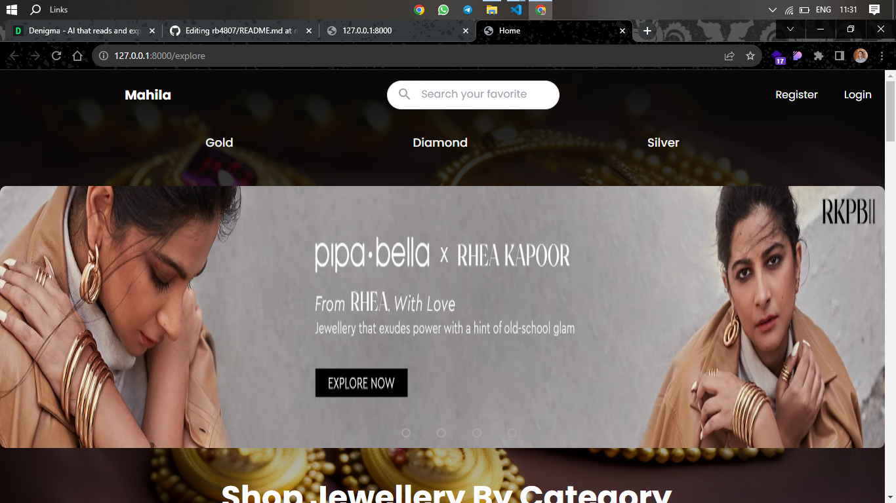

<h1 align="center"> Jewelry Shopping Web Application</h1>

This is my recent web application development. I employed HTML5, TailwindCSS, Ajax, jQuery, and JavaScript for frontend development. As for backend development, I utilized Django Framework, and for database management, I utilized PostgreSQL. For further reference and access, please visit my GitHub repository. The implemented features are listed below.

